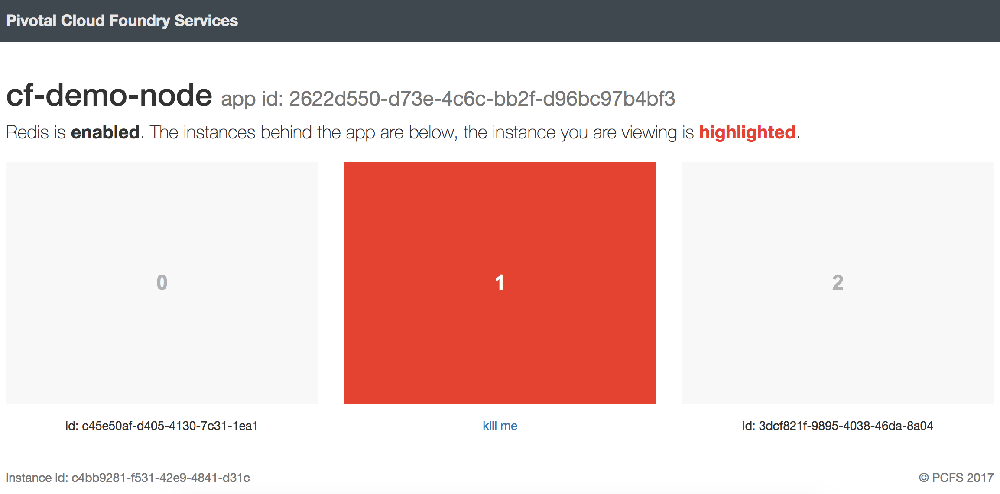

# cf-demo-node

A simple Node.js app for Cloud Foundry, which can be used to demonstrate:

- deployment using manifest files
- configuration via environment variables
- application HA
- service binding
- zero downtime (ie blue / green) deployments

You can see a [live demo here](https://cf-demo-node.cfapps.io/) (note, killing disabled for that particular deployment)
